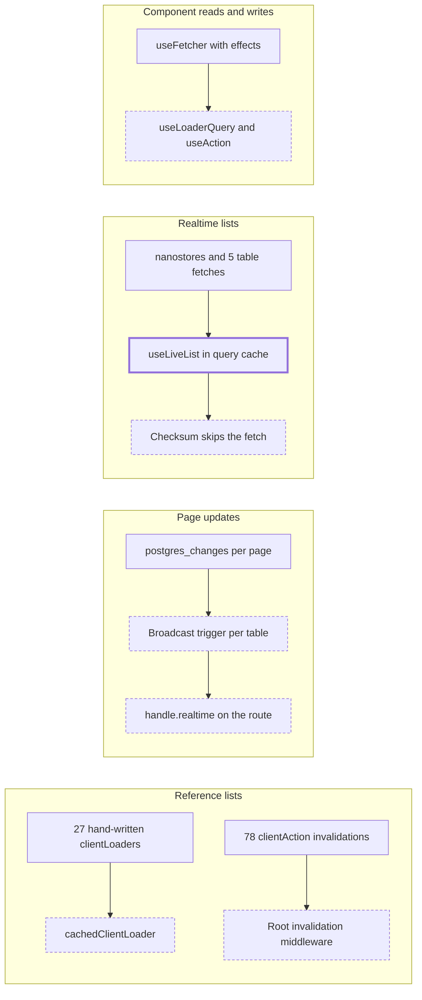

# Client query cache and realtime broadcast

> Status: in-progress
> Author: Sidwebworks
> Date: 2026-10-04

## TLDR

The ERP and the MES get one client cache and one realtime system. A
`cachedClientLoader()` factory caches the `api+` reference lists by URL, and one
root middleware marks them stale after every mutation. Postgres sends a small
broadcast message for each changed table, and a route declares the tables it
shows, so operational pages update live in both apps. The four realtime lists
(items, customers, suppliers, people) move into the query cache. A change log
tells the client which rows changed since its stored copy. `useLoaderQuery` and `useAction` replace
hand-written fetcher effects. nanostores leaves the repo.

Research: `.ai/research/2026-10-01-client-cache-on-react-router.md`.

## Overview diagram



## Problem Statement

The client has four defects today.

| # | Defect | Evidence |
|---|--------|----------|
| 1 | A cached route never goes stale. | The 27 cached `api+` routes read with `getQueryData` and write with `setQueryData`. Both ignore `staleTime` and `invalidateQueries`. |
| 2 | Each mutation route must name the keys it invalidates. | 78 route files export a `clientAction` for this. A route that forgets one leaves a stale dropdown. |
| 3 | A page that shows a table can miss its changes. | The ERP job page has no subscription on `jobOperation` or `job`. An operation completed in the MES does not show until a reload. The page also subscribes to `jobOperationStep` and `jobOperationStepRecord`, and the publication contains neither, so both subscriptions deliver nothing. |
| 4 | The realtime lists cost five whole-table fetches on each cold load. | `RealtimeDataProvider.tsx:88` reads `item`, `supplier`, `customer`, `employees` and `itemSupersession` from the browser, about 950 ms each (measured 2026-09-18). |

Two more defects come from the realtime provider itself.

- The provider writes the item column list three times. The insert handler maps
  `description`, which the fetch never selects. No handler updates the
  supersession fields.
- `postgres_changes` does one permission check for each subscriber for each
  change, on one thread for all tenants. One company's bulk write can delay the
  updates of every other company.

## Proposed Solution

The change has four parts. Each part stands on its own code, and the parts share
the query cache.

### Part 1 — Query cache for `api+` reference lists

1. Add `cachedClientLoader<typeof loader>(options?)` to
   `apps/erp/app/utils/react-query.ts`.
2. Key each entry as `[LOADER, companyId, pathname, search]`. `LOADER` is the
   string `"loader"`.
3. Read with `fetchQuery`, so `staleTime` and in-flight dedupe apply.
4. Set `clientLoader.hydrate = true` on the returned function.
5. Replace the body of each of the 27 cached `clientLoader` exports with one call.
6. Add the invalidation middleware to `clientMiddleware` in the ERP `root.tsx`.
7. Delete the 78 `clientAction` exports that only invalidate a key.
8. Delete the key factories in `react-query.ts` that no caller uses after step 7.

```ts
export function cachedClientLoader<L>(options?: { staleTime?: number }) {
  const clientLoader = ({ request, serverLoader }: ClientLoaderFunctionArgs) => {
    const cache = getClientCache();
    const companyId = getCompanyId();
    if (!cache || !companyId) return serverLoader<L>();
    const url = new URL(request.url);
    return cache.fetchQuery({
      queryKey: [LOADER, companyId, url.pathname, url.search],
      queryFn: () => serverLoader<L>(),
      staleTime: options?.staleTime ?? RefreshRate.Low,
      gcTime: LOADER_GC_TIME
    });
  };
  clientLoader.hydrate = true as const;
  return clientLoader;
}
```

The middleware runs after each request. If the method is `GET`, it does
nothing. If the path is `/refresh-session`, it does nothing. Otherwise it calls
`invalidateQueries({ queryKey: [LOADER] })`.

`getCompanyId()` reads `document.cookie`, and the `companyId` cookie is
httpOnly, so the function returns `null` today. Part 1 replaces it with a value
that the shell layout sets from `useUser().company.id` on mount. The live-list
keys in Part 3 use the same value.

### Part 2 — Realtime by broadcast

**Database.** One function, `broadcast_table_changes`, sends one message for each
company for each statement. The message holds the table name, the operation and
the changed ids. It holds no row data.

**Topic.** `company:<companyId>:<table>`. The channel is private.

**Authorization.** One policy on `realtime.messages` lets a user join a topic
only if the user is an employee of the company in the topic.

**Client.** A route declares the tables it shows:

```ts
export const handle = { realtime: ["job", "jobOperation"] };
```

One hook in each shell layout, `useRouteRealtime()`, does these steps:

1. Read `useMatches()` and collect the unique table names from `handle.realtime`.
2. Subscribe to one private channel for each table.
3. On a message, start a 300 ms debounce timer. A new message restarts the timer.
4. When the timer ends, check the fetchers. If a fetcher is submitting, wait for it to finish.
5. Call `invalidateQueries({ queryKey: [LOADER] })`.
6. Call `revalidator.revalidate()`.
7. On a reconnect, do steps 5 and 6 one time.

`useRealtime(table, filter?)` keeps its signature for components that are not a
route. If the filter is `id=eq.<id>` or `id=in.(<ids>)`, the hook compares the
message ids with the filter ids. If the filter names another column, the hook
ignores the filter and wakes on any change to the table.

**Reference lists.** A cached `api+` loader is not a matched route, so
`useMatches()` does not see it. The tables behind the cached reference lists get
a second function, `broadcast_reference_changes`. It sends
`{ table, op }` to one shared topic, `company:<companyId>:reference`. Each shell
layout subscribes to that one topic. On a message, the shell calls
`invalidateQueries({ queryKey: [LOADER] })` after the same 300 ms debounce. Each
active `useLoaderQuery` then refetches.

**Notifications.** `useNotifications` subscribes to
`user:<userId>:notification`. On an `INSERT` or `UPDATE` message, the hook reads
the rows with those ids and the current `companyId` through PostgREST. Then it
applies the same rules as today for `digestedInto`. On a `DELETE` message, the
hook removes the rows with those ids.

### Part 3 — Live lists

`useItems()`, `useCustomers()`, `useSuppliers()` and `usePeople()` keep their
names and their `[value, setValue]` return shape. About 200 files call them.

Each list becomes a `useLiveList` definition. The definition holds the table,
the column list, the sort function and the query key
`["live", companyId, <list>]`. The column list has one copy. A definition can
name related tables, for example `itemSupersession` for the item list.

Cold load does these steps:

1. Read each list and its cursor from IndexedDB (`<list>:<companyId>`).
2. Put each list in the query cache.
3. Call `table_changes_since` one time, with the oldest cursor.
4. If the answer is `reset`, fetch each list in full.
5. Otherwise, for each list, read only the rows that the answer names.
6. Remove a named row that the read does not return.
7. Write each list and the new cursor to IndexedDB.

The reader answers `reset` in 3 cases:

- The client sent no cursor.
- The server restarted after it issued the cursor.
- The cursor is older than 6 days.

The client also fetches a list in full when the answer names more than 500 changed rows for it.

A broadcast message does these steps:

1. If `ids` is null, do the cold-load steps 3 to 7 for that list.
2. If `op` is `DELETE`, remove the rows with those ids from the cache.
3. Otherwise, read the rows with those ids through PostgREST with the list's column list.
4. Merge the rows into the cache and sort.
5. Write the list to IndexedDB. The cursor does not change.

A reconnect does the cold-load steps 3 to 7.

### Part 4 — Component hooks

| Hook | Replaces | Behavior |
|------|----------|----------|
| `useLoaderQuery<typeof loader>(url, options?)` | `useFetcher` + `fetcher.load(url)` in a mount effect (137 call sites) | `useQuery` over the same `[LOADER, companyId, pathname, search]` key. Five pickers on one page share one request. |
| `useAction<typeof action>({ onSuccess, onError })` | `useFetcher` + an effect that watches `fetcher.data` (435 submit call sites) | Wraps `useFetcher`. Returns `submit`, `isPending`, `data` and `pending` (the form values in flight). It writes nothing to the cache. |

Part 4 migrates each call site where a fetcher loads an `api+` URL or submits
to a route action. A `fetcher.load` of a page route stays on `useFetcher`.

### Design Decisions

| Decision | Choice | Rationale |
|----------|--------|-----------|
| Cache engine | Keep `@tanstack/react-query` on the existing `window.clientCache` client | The app already ships it. A second client would split invalidation. |
| Cache key | URL: `[LOADER, companyId, pathname, search]` | React Router's own client-cache guide keys by URL. A route author writes no key. |
| Invalidation after a mutation | Mark every `LOADER` entry stale | It costs one extra fetch when a list is next used. It removes 78 hand-written invalidations and the key registry. |
| `LOADER` prefix | Required | A bare `invalidateQueries()` also refetches each active `useQuery`, for example the 3D model loader, on each save. |
| Page data | Not cached | A route with a `clientLoader` leaves the combined `.data` request. `dataStrategy` is closed in framework mode. |
| `gcTime` for loader entries | 30 minutes | The client default is `Infinity`. URL keys create one entry for each distinct search string. |
| Realtime transport | Broadcast from the database | Realtime checks permission one time at join. `postgres_changes` checks each change for each subscriber on one thread. |
| Trigger attachment (user, 2026-10-05) | Declared in `event-system/attachments.ts`, applied by `set_event_triggers` | Each attach call replaces the whole list of a table. One typed manifest removes the clobber risk. No migration attaches a trigger. |
| Interceptor bodies (user, 2026-10-05) | Managed files in `event-system/handlers/` | The 63 interceptors and `apply_item_stock_quantities` leave the migrations. `authz sync` and `authz migration` own them. |
| Message payload | `{ table, op, ids }`, ids null above 100 rows | The client reads rows through PostgREST, so table RLS still decides what a user sees. |
| Topic grain (user, 2026-10-04) | One topic for each company for each table | A caller with a parent-column filter wakes on any change to the table. The debounce bounds the cost. |
| Tables with a trigger (user, 2026-10-04) | Only tables that a route or a live list declares | A table that no page watches gets no write overhead and stores no messages. |
| Page coverage (user, 2026-10-04) | Operational pages in the ERP, all of the MES, and the cached reference lists | Settings and admin pages change rarely. They reload on navigation as today. |
| Reference lists | One shared topic, `company:<companyId>:reference` | One channel for each client covers every reference table. A topic for each table would hold about 30 channels open for the whole session. |
| Policies on `realtime.messages` (user, 2026-10-04) | The authz manifest, entry `"realtime.messages"` | One system owns every policy. A hand-written migration would bypass `authz sync` and the migration check. |
| Source of truth for the table list | `REALTIME_TABLES`, derived from `attachments.ts` | A table is realtime when its entry attaches `broadcast_table_changes`. No second list exists. |
| Missed-declaration guard | New `realtime-table-has-trigger` check in `@carbon/checks` | `postgres_changes` fails silently for an unpublished table. The check makes that a build failure. |
| Publication (user, 2026-10-04) | Drop the moved tables from `supabase_realtime` in this PR | A tab on the old build goes quiet until a reload. It shows no error. |
| Tables that stay on `postgres_changes` (user, 2026-10-04) | None | The publication ends empty. No second realtime system stays in the code. |
| Notifications (user, 2026-10-04) | Private topic `user:<userId>:notification`, sent by `broadcast_user_changes` | A company topic would wake every employee for each notification of each other employee. |
| `implementationHub` | `broadcast_table_changes` reads the company from `id` for this table | The table has no `companyId` column. Its `id` is the company id. |
| Ignored updates | Skip an update that changes only `updatedAt`, `updatedBy` or `embedding` | `dispatch_event_batch` has the same rule. `event-dispatch.test.ts` checks that the two lists match. |
| List storage | Query cache, key `["live", companyId, <list>]` | One store for server data. nanostores has no other user after this change. |
| Cold-load sync (user, 2026-10-05) | A change log: the `tableChange` table and `table_changes_since(cursor)` | The client reads only the rows that changed since its stored copy. A checksum refetches a whole list when one row changes, and it scans every row on each load. |
| Change log storage (user, 2026-10-05) | `UNLOGGED` table | The log insert on each write skips WAL. A crash empties the table. The reader detects a server restart by its epoch and answers `reset`. |
| Change log cursor | The transaction id `pg_snapshot_xmin(pg_current_snapshot())` | A sequence value is taken before commit. A reader that keeps "the highest id" skips a row whose transaction commits late. |
| Change log retention | 7 days, purged hourly by `pg_cron` | A cursor older than 6 days gets `reset`. The 1-day margin covers a purge that runs between the check and the read. |
| Reader security | `SECURITY DEFINER` with a company check | The table has no API access. The reader reveals row ids only, as a broadcast does. The client re-reads the rows under table RLS. |
| A renamed user | `log_user_changes` logs it as an `employee` change for each company of that user | The `user` row has no `companyId`. Each company shows the name in its people list. |
| IndexedDB | Keep localforage, keys `<list>:<companyId>` | `.ai/lessons.md` line 254: a cache without `companyId` in its key leaks across tenants. |
| `useAction` scope (user, 2026-10-04) | Pending state and callbacks only | Mutations stay plain router actions. Optimistic cache writes are out of scope. |
| Shared code | `useRouteRealtime`, `useLiveList`, `useRealtime` live in `@carbon/react` | Both apps need them. The `no-duplicated-app-file` check forbids a copy in each app. `@carbon/react` already depends on `react-router`. |
| MES cache | The MES root adopts `window.clientCache` and the same middleware | `useLiveList` and the invalidation need one client that code outside React can reach. |
| Heuristics 1, 3, 6 (new tables, RLS on new tables, module layout) | N/A | The change adds no table and no module. |
| Heuristic 2 (service shape) | N/A | The change adds no service function. The browser calls `list_checksums` through `carbon.rpc`. |
| Heuristic 4 (permission scoping) | No change | No route changes its `requirePermissions` call. |
| Heuristic 5 (form pattern) | No change | `ValidatedForm` and its props stay as they are. `useAction` wraps `useFetcher` only. |
| Heuristic 7 (backward compatibility) | One break: the publication drop | The API, the MCP tools and the webhooks do not change. |

## Data Model Changes

One migration. It adds no table and no column.

```sql
-- 1. Broadcast function (managed file:
--    packages/database/src/event-system/functions/broadcast_table_changes.sql)
CREATE OR REPLACE FUNCTION public.broadcast_table_changes()
RETURNS trigger LANGUAGE plpgsql SECURITY DEFINER SET search_path = '' AS $$
DECLARE
  ignored_columns CONSTANT TEXT[] := ARRAY['updatedAt', 'updatedBy', 'embedding'];
  rec RECORD;
  source_sql TEXT;
BEGIN
  IF TG_OP = 'UPDATE' THEN
    source_sql := 'SELECT to_jsonb(n) - $1 AS c FROM batched_new n
                   EXCEPT SELECT to_jsonb(o) - $1 FROM batched_old o';
  ELSIF TG_OP = 'DELETE' THEN
    source_sql := 'SELECT to_jsonb(o) AS c FROM batched_old o';
  ELSE
    source_sql := 'SELECT to_jsonb(n) AS c FROM batched_new n';
  END IF;

  FOR rec IN EXECUTE format(
    -- implementationHub has no companyId: its id is the company id
    'SELECT coalesce(c->>''companyId'',
              CASE WHEN $2 = ''implementationHub'' THEN c->>''id'' END) AS company_id,
            count(*) AS n,
            jsonb_agg(c->''id'') FILTER (WHERE c ? ''id'') AS ids
       FROM (%s) changed GROUP BY 1',
    source_sql
  ) USING ignored_columns, TG_TABLE_NAME LOOP
    CONTINUE WHEN rec.company_id IS NULL;
    PERFORM realtime.send(
      jsonb_build_object(
        'table', TG_TABLE_NAME,
        'op', TG_OP,
        'ids', CASE WHEN rec.n <= 100 THEN rec.ids END
      ),
      TG_OP,
      'company:' || rec.company_id || ':' || TG_TABLE_NAME,
      true
    );
  END LOOP;
  RETURN NULL;
END $$;

-- 2. Who can join a company topic (authored in authz/manifest.ts, not in a migration)
CREATE POLICY "company topic"
ON realtime.messages FOR SELECT TO authenticated
USING (
  split_part(realtime.topic(), ':', 1) = 'company'
  AND split_part(realtime.topic(), ':', 2) = ANY (
    (SELECT get_companies_with_employee_role())::text[]
  )
);

CREATE POLICY "user topic"
ON realtime.messages FOR SELECT TO authenticated
USING (
  split_part(realtime.topic(), ':', 1) = 'user'
  AND split_part(realtime.topic(), ':', 2) = (SELECT auth.uid())::text
);

-- broadcast_user_changes: the same body as broadcast_table_changes, but it
-- groups by c->>'userId' and sends to 'user:' || user_id || ':' || TG_TABLE_NAME
SELECT attach_statement_handler('notification', ARRAY['broadcast_user_changes']);

-- 3. Attach, one line for each table in REALTIME_TABLES
SELECT attach_statement_handler('item', ARRAY['broadcast_table_changes']);
-- itemLedger keeps its existing handler: attach_statement_handler replaces the list
SELECT attach_statement_handler('itemLedger',
  ARRAY['apply_item_stock_quantities', 'broadcast_table_changes']);

-- 4. Leave postgres_changes, one line for each moved table
ALTER PUBLICATION supabase_realtime DROP TABLE public.item;

-- 5. The change log (20261004200418_table-change-log.sql)
CREATE UNLOGGED TABLE "tableChange" (
  "id" BIGINT GENERATED ALWAYS AS IDENTITY,
  "companyId" TEXT NOT NULL,
  "table" TEXT NOT NULL,
  "rowId" TEXT,                 -- NULL: more than 100 rows changed in one statement
  "xid" XID8 NOT NULL DEFAULT pg_current_xact_id(),
  "createdAt" TIMESTAMP WITH TIME ZONE NOT NULL DEFAULT NOW(),
  CONSTRAINT "tableChange_pkey" PRIMARY KEY ("id", "companyId"),
  CONSTRAINT "tableChange_companyId_fkey" FOREIGN KEY ("companyId") REFERENCES "company"("id") ON DELETE CASCADE ON UPDATE CASCADE
);

-- table_changes_since(p_company_id, p_xid, p_epoch, p_at) returns
-- { reset, changes: { "<table>": ["<rowId>", ...] | null }, xid, epoch, at }
```

Rules for the migration:

- The statement handlers `log_table_changes` and `log_user_changes` write the log. `attachments.ts` attaches them to `item`, `itemSupersession`, `customer`, `supplier`, `employee`, `modelUpload` and `user`.
- The table has no audit columns and no `id('prefix')` default. It is a log that only triggers write.
- The backup engine skips the table. Its transaction ids mean nothing in another database.
- `itemSupersession` has no `id` column. Its message and its log row carry the `itemId`.
- `itemStockQuantities` has no `id` column. Its message carries `ids: null`, so the client invalidates.
- The people list reads the `employees` view. A change to `user.name` sends no
  message, as today. The change log records it, so the next load or reconnect reads that person again.
- The 3 broadcast functions are managed files under `packages/database/src/event-system/functions/`. They ship through `authz migration`, not a hand-written migration.
- The authz manifest owns the 2 policies on `realtime.messages`. The manifest key is `"realtime.messages"`, built with `external()`.
- `authz sync`, `authz migration` and the `no-authz-ddl-in-migrations` check read the schema from the key. A key with no dot is a `public` table.
- Supabase owns the RLS switch of `realtime.messages`. The sync fails if the switch is off. The sync never changes it.
- Run `pnpm run generate:types` after the migration, before the typecheck.

## API / Service Changes

| File | Change |
|------|--------|
| `apps/erp/app/utils/react-query.ts` | Add `LOADER`, `cachedClientLoader`, `loaderQueryKey(url)`, `setCompanyId`. Delete the unused key factories and `invalidate*` helpers. |
| `packages/auth/src/middleware/` | Add `createInvalidationMiddleware(getCache, refreshSessionPath)`. Both app roots add it to `clientMiddleware`. |
| `apps/erp/app/routes/api+/*` (27 files) | `export const clientLoader = cachedClientLoader<typeof loader>()`. |
| `apps/erp/app/routes/x+/**` (78 files) | Delete the `clientAction` export. |
| `packages/database/src/realtime-tables.ts` | New `REALTIME_TABLES` and `REALTIME_REFERENCE_TABLES` constants. The second list holds the tables behind the cached `api+` loaders. |
| `packages/react/src/hooks/useRealtimeChannel.ts` | New `private?: boolean` option, passed to `carbon.channel(topic, { config: { private } })`. |
| `packages/react/package.json` | Add `@tanstack/react-query`, at the version the apps use. |
| `packages/react/src/hooks/` | New `useRouteRealtime`, `useRealtime`, `useLiveList`, `useLoaderQuery`, `useAction`. The `useRealtime` and `useDebouncedRealtime` files in each app become re-exports. |
| `packages/checks/src/conformance/` | New `realtime-table-has-trigger` check with its test. |
| `apps/mes/app/root.tsx` | Set `window.clientCache`, as the ERP root does. |
| `.claude/rules/clientAction-patterns.md`, `coding-conventions.md` | Rewrite the cache and state sections. Add a `realtime-system.md` rule. |
| `.ai/lessons.md` | Add the job-page lesson: a subscription to an unpublished table fails silently. |

`fetchQuery` waits for the refetch when an entry is stale. A component that
needs the old value at once reads through `useLoaderQuery`.

## UI Changes

No new page and no new component. These behaviors change:

| Where | Change |
|-------|--------|
| ERP operational routes and all MES routes | Add `handle.realtime` with the tables that the loader reads. |
| ERP job page (`x+/job+/$jobId.tsx`) | Declares `job`, `jobOperation`, `jobMaterial`, `jobOperationStep`, `jobOperationStepRecord`, `productionEvent`, `pickingListLine`. |
| 41 files that subscribe today | A route moves to `handle.realtime`. A component keeps `useRealtime`. A component that reads the row payload reads the row by id. |
| `RealtimeDataProvider` (ERP and MES) | Becomes four `useLiveList` calls (ERP) and two (MES). The reducers go. |
| `apps/erp/app/stores/{items,customers,suppliers,people}.ts` and the MES pair | Hooks read the query cache. `useParts`, `useTools`, `useServices`, `useMaterials` become `select` filters. |
| `useNanoStore` in `@carbon/react` | Deleted, with the `nanostores` and `@nanostores/react` dependencies. |
| `Form/Item.tsx` on-hand badge | A `itemStockQuantities` message invalidates the `itemQuantities` query, as today. |

"Operational routes" means the route folders for: job, production, scheduling,
priority, quote, sales-order, sales-rfq, sales-invoice, sales-return-order,
purchase-order, purchasing-rfq, supplier-quote, purchase-invoice,
purchase-return-order, shipment, receipt, inventory, inventory-count,
picking-list, stock-transfer, warehouse-transfer, issue, inspection,
change-order, change-notice, maintenance, and the list pages under items,
sales, purchasing, invoicing and quality. The folders settings, users, account,
accounting, people, resources, documents, templates and workflows keep their
existing subscriptions only.

## Acceptance Criteria

- [ ] An operator completes an operation in the MES. The ERP job page for that job shows the operation as complete within 3 seconds, with no reload.
- [ ] A user adds a customer type. The customer type picker on another open form shows the new type after the save, with no reload.
- [ ] A second user in the same company adds a customer type. The first user's picker shows it within 3 seconds.
- [ ] A cold load with no change sends 1 `table_changes_since` request and 0 requests to `item`, `supplier`, `customer`, `employees` or `itemSupersession`.
- [ ] A cold load after another user renames 1 customer sends 1 request to `customer`, with `id=in.(<that id>)`.
- [ ] A cold load after a database restart fetches each list in full.
- [ ] A user deletes an item while a second user's tab is closed. The second user's item list lacks that item after the next load.
- [ ] A notification for user A shows in user A's bell within 3 seconds. User B in the same company cannot join `user:<A>:notification`.
- [ ] `SELECT count(*) FROM pg_publication_tables WHERE pubname = 'supabase_realtime'` returns 0.
- [ ] A user in company A cannot join `company:<B>:item`. The subscribe call returns an error.
- [ ] A user switches company. No list and no cached loader entry from the first company appears.
- [ ] An update that changes only `updatedAt` on `item` sends no message.
- [ ] A bulk update of 10,000 `item` rows sends 1 message for each company, with `ids` null.
- [ ] A realtime message that arrives while a fetcher is submitting does not cancel that fetcher's redirect (MES "Complete Batch").
- [ ] `grep -r nanostores apps packages --include=*.ts --include=*.tsx` returns no file.
- [ ] `grep -r "postgres_changes" apps packages` returns no file.
- [ ] No file under `apps/erp/app/routes` exports a `clientAction`, or each one that stays does more than invalidate.
- [ ] The `realtime-table-has-trigger` check fails when a route declares a table that `REALTIME_TABLES` lacks.
- [ ] `event-dispatch.test.ts` fails when the ignored-column list in `broadcast_table_changes.sql` differs from `auditConfig.skipFields`.
- [ ] The local stack and the self-hosted compose stack (Realtime v2.89.0) both deliver a broadcast on a private channel.
- [ ] `pnpm exec turbo run typecheck --filter=erp`, `--filter=mes`, `--filter=@carbon/react`, `--filter=@carbon/database` and `--filter=@carbon/checks` pass, one at a time.
- [ ] `pnpm run lint` and `pnpm run test` pass.

## Risks

| Risk | Severity | Mitigation |
|------|----------|------------|
| A mistake in the `realtime.messages` policy leaks change signals across companies. | High | The policy uses the same helper as the table policies. A database test joins a foreign company topic and expects a refusal. |
| A dropped broadcast leaves a list or a page stale. | Med | A reconnect and a tab focus both run the catch-up steps. The checksum runs on each load. |
| The PR is large: about 27 + 78 + 41 + 137 + 435 call sites and one migration. | High | The plan orders the work in phases that each pass the typecheck. Mechanical edits use a codemod. Each phase has a browser check. |
| Tabs on the old build go quiet after the publication drop. | Med | The user accepted this. The lists and pages recover on reload. |
| The broadcast trigger slows writes on `itemLedger`, `jobOperation` and `productionEvent`. | Med | The trigger is statement-level and sends ids only. Measure with `EXPLAIN ANALYZE` on one insert before and after. |
| `realtime.messages` grows on busy tables. | Low | Realtime keeps messages for about three days. The payload is ids only, capped at 100. |
| A crash empties the `UNLOGGED` change log. | Med | The reader compares the server start time with the cursor's epoch and answers `reset`. Each client then fetches its lists one time. |
| A bug in the change log leaves a list stale with no error. | High | `realtime-broadcast.test.sql` covers the writer and the reader. `liveList.test.ts` covers the plan. A browser check covers a change made while the tab is closed. |
| Realtime v2.89.0 lacks `realtime.send` or private channels. | Med | Verify on the local stack as the first task of the plan. If it fails, raise the image version in both compose files. |
| Blunt invalidation refetches every active `useLoaderQuery` after each save. | Low | Each refetch is one small `api+` request. `staleTime` does not stop it, by design. |
| A realtime revalidation re-runs every loader of the page. | Med | The debounce collapses bursts. Shell loaders already skip through `shouldRevalidate`. |
| A `handle.realtime` list on a route goes out of date when its loader reads a new table. | Med | The check covers a missing trigger only. The new rule file tells the author to update the list with the loader. |
| `useAction` changes the timing of `onSuccess` against a redirect. | Med | Migrate one module first and run its browser playbook before the codemod. |

## Open Questions

- [x] May the PR add a policy on `realtime.messages` and triggers on core tables? — **Answer:** Yes, both. The user runs `db:migrate`.
- [x] How do the lists avoid the whole-table fetches on cold load? — **Answer:** A change log on an `UNLOGGED` table. The user replaced the checksum on 2026-10-05: a checksum refetches a whole list for one changed row.
- [x] How much goes in the first PR? — **Answer:** Everything: the cache, the component hooks and all realtime callers.
- [x] How does a caller with a parent-column filter work on broadcast? — **Answer:** One topic for each table. The caller wakes on any change to the table.
- [x] Does the ERP job-page bug get its own fix? — **Answer:** No. It ships in this rewrite. The goal is live pages in the ERP and the MES.
- [x] Which pages update live? — **Answer:** Operational pages, all of the MES, and the cached reference lists.
- [x] Which tables get the trigger? — **Answer:** Only the tables that a route or a live list declares.
- [x] When do the tables leave the publication? — **Answer:** In this PR.
- [x] How far does `useAction` go? — **Answer:** Pending state and callbacks only. No optimistic cache writes.
- [x] Do `notification` and `implementationHub` move to broadcast? — **Answer:** Yes. Notifications use a private topic for each user. Nothing stays on `postgres_changes`.

## Changelog

- 2026-10-04: Created. All nine questions were answered by the user before writing.
- 2026-10-04: Notifications and the implementation hub move to broadcast. The publication ends empty.
- 2026-10-04: Planning found that the broadcast functions are managed event-system files. `@carbon/react` gains `@tanstack/react-query`.
- 2026-10-04: The authz manifest owns the `realtime.messages` policies (user decision). The authz system now handles one table outside `public`.
- 2026-10-05: The user moved all event triggers and interceptor bodies out of migrations. `attachments.ts` declares the triggers of 141 tables. `event-system/handlers/` holds 64 functions. The takeover migration is `20261004194527_event-attachments.sql`.
- 2026-10-05: The user replaced the checksum with a change log (`tableChange`, `UNLOGGED`, `table_changes_since`). The shared code moved to the new `@carbon/query` package, and `~/utils/react-query` is gone. All listeners of a topic share one channel.
- 2026-10-05: `useAction` moves 98 single-condition effects. The 133 mutation effects with several branches stay for a follow-up PR (user decision). 13 event-driven load sites stay on `useFetcher`.
