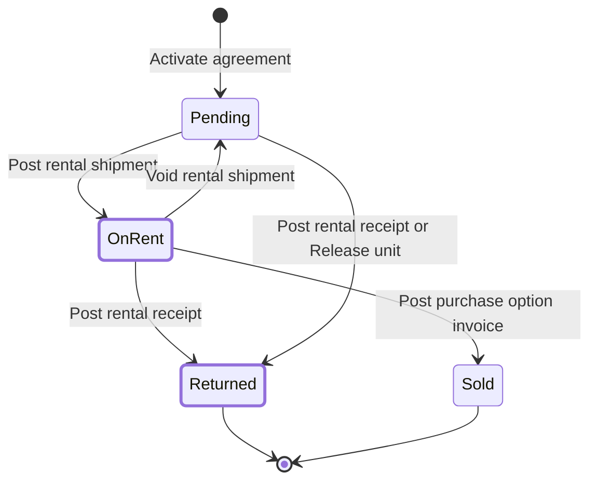

# Rental Shipments and Receipts

> Status: draft
> Author: Claude (with Brad)
> Date: 2026-10-07

## TLDR

A rental unit now goes out on a **rental shipment** and comes back on a
**rental receipt**. Both are ordinary `shipment` and `receipt` documents with
the new source document `'Rental Agreement'`. They replace the Deliver and
Return actions on the rental agreement. A unit rides on the existing
fixed-asset line tables, so posting writes no `itemLedger` row and no journal
for a `Rental` line. Posting a rental shipment puts the unit On Rent. Posting
a rental receipt returns it, re-cuts its billing and moves the asset to the
receipt's location. The agreement header gets one Deliver button and one
Return button, like the sales order's Ship button. Each unit's page keeps a
shortcut that opens a document for that one unit.

## Overview diagram



The bold states change: a document now moves the line into them. The void
edge and the Pending to Returned edge are new.

## Problem Statement

Delivery and return of a rental unit are physical events. Today they leave
no document behind.

1. **Deliver is a button.** `x+/rental-agreement+/$id.$lineId.deliver.tsx`
   sets the line `On Rent` and stamps `deliveredAt` with the company's today.
   The user cannot backdate it. Nothing records the carrier, the tracking
   number, the ship-from location or the meter reading. `rentalAgreementLine.meterOut`
   exists, but no code writes it.
2. **Return is a form on the agreement.** `post-rental-agreement` type
   `return` records `returnedAt`, `meterIn` and notes. It records no
   location. A `Rental` line return writes no `trackedActivity`.
3. **The warehouse cannot see the work.** Neither event shows in
   Inventory → Shipments or Inventory → Receipts. The warehouse team must open
   a sales document to deliver a unit.
4. **No delivery ticket.** The customer gets no packing slip for a rental
   unit.
5. **The asset's location never changes.** A unit that comes back to a
   different yard still shows its old `fixedAsset.locationId`.

Example: agreement RA-000012 rents 5 units. The driver delivers 3 on Monday
and 2 on Wednesday. Today the user must press Deliver 5 times, on the day of
each delivery. No shipment shows what left the yard, and the customer gets no
delivery ticket.

## Proposed Solution

### Research

`.ai/research/rental-delivery-and-return.md` surveys SAP S/4HANA, NetSuite
rental SuiteApps, Dynamics 365 rental add-ons (DynaRent), Texada, Wynne and
Point of Rental. The consensus:

- Delivery and return are separate documents linked to the contract. One
  document holds many units. Partial returns are normal.
- The move of a capitalized rental unit posts no inventory value and no
  journal. SAP movement types 631 and 632 work this way.
- The unit's current location updates at return. No transfer document is
  necessary.
- Rental systems bill from delivery. SAP contract billing bills from the
  contract dates. Carbon bills from the agreement start date and keeps that
  rule (Q4).

### Flow

**Deliver** (agreement header, Active agreement):

1. If the agreement has a Draft rental shipment, the button opens it.
2. Otherwise the route creates a Draft rental shipment.
3. The shipment's location is `rentalAgreement.locationId`.
4. The shipment has one asset line for each `Pending` unit that is not on
   another open rental shipment.
5. Each asset line starts with `shipped = true`.
6. The user unticks the units that do not go.
7. The user enters meter out, carrier and tracking.
8. The user clicks **Post**. The post modal asks for **Delivered on**.
9. The user confirms, and the shipment posts.

**Return** (agreement header, Active agreement): the same steps, with a rental
receipt, with 2 differences:

1. The receipt holds every `On Rent` unit with `received = true`.
2. The receipt also holds every `Pending` unit with `received = false` (Q8).

The user unticks the units that do not come back. A `Pending` unit on a
receipt is a unit that never left the yard. Ticking it stops its billing at the
return date.

**Per-unit shortcut** (unit page, `Deliver` or `Return`):

1. If the agreement has a Draft document of that kind, the route adds the unit
   to it when it is missing. Then the route opens the document.
2. Otherwise the route creates a Draft document with that one unit.
3. The shortcut always adds its unit ticked, also a `Pending` unit on a
   receipt.

For a counter pickup this is two clicks: the shortcut, then **Post**.

After an agreement has a rental shipment, the header's Deliver button becomes
a **Shipments** dropdown: "New Shipment" plus the list of the agreement's
shipments. Return becomes a **Receipts** dropdown in the same way. This copies
`SalesOrderHeader`.

### Posting a rental shipment (`post-shipment`, new case `'Rental Agreement'`)

In one Kysely transaction:

1. Lock the shipment `FOR UPDATE`.
2. Read the ticked asset lines (`shipped = true`). If there is none, refuse
   with "Select at least one unit to deliver".
3. Lock each rental line `FOR UPDATE`.
4. If a rental line is not `Pending`, or its agreement is not `Active`, refuse
   the whole shipment. The message names the unit.
5. If a unit is out of service, refuse. The message names the reason.
6. Set each line `On Rent`, `deliveredAt` = the date from the post modal, and
   `meterOut` = the asset line's meter.
7. If the line has a `trackedEntityId`, write a `trackedActivity` of type
   `Rental Delivery`.
8. Set the shipment `Posted`, with `postingDate` = the date from the post
   modal.

The posting writes no `itemLedger`, `costLedger` or journal row. A `Sale`
line uses the same path. Activation already derecognized its unit, so
delivery only records custody.

### Posting a rental receipt (`post-receipt`, new case `'Rental Agreement'`)

In one Kysely transaction:

1. Lock the receipt `FOR UPDATE`.
2. Read the ticked asset lines (`received = true`). If there is none, refuse
   with "Select at least one unit to return".
3. For each line, run the shared `returnRentalUnit` function. It holds the
   body of today's `returnUnit` in `post-rental-agreement`:
   1. It locks the rental line. The receipt case refuses a line that is not
      `Pending` or `On Rent` before the call.
   2. It refuses a `returnedAt` in the future (`futureReturnError`).
   3. For a `Rental` line, it re-cuts the billing periods and adds the
      early-return adjustment row.
   4. For a `Sale` line, it runs `returnResidual` with the line's
      `residualDestination` and the receipt's `locationId` (Q7).
   5. It sets the line `Returned` with `returnedAt`, `meterIn` and
      `returnNotes`.
   6. If `takeOutOfService` is true, it sets `fixedAsset.outOfServiceSince`
      and `outOfServiceReason`.
4. Set `fixedAsset.locationId` to the receipt's `locationId`. A `Sale` line
   returned to Fleet gets a new asset at that location. A `Sale` line returned
   to Inventory books its stock at that location (Q7).
5. If the line has a `trackedEntityId`, write a `trackedActivity` of type
   `Rental Return`. A `Sale` line keeps its existing `Return to Inventory`
   activity instead.
6. Set the receipt `Posted`, with `postingDate` = the date from the post
   modal.

`returnedAt` is the date from the post modal. A `Rental` line return writes no
`itemLedger` row and no journal. A `Sale` line return to Inventory writes the
same stock adjustment and journal as today, at the receipt's location. The
receipt's location defaults to the agreement's location, so the two differ
only when the user changes it.

### Void

| Document | Rule |
|----------|------|
| Rental shipment | The void needs 2 conditions for every ticked unit. The unit is still `On Rent`. No `Accrual` row in `revenueRecognitionSchedule` for its line is `Posted` or claimed by a Draft run (`runLineId` set). If both hold, the void sets each line back to `Pending` and clears `deliveredAt` and `meterOut`. It deletes the unit's unclaimed `Planned` `Accrual` rows and sets the shipment `Voided`. Otherwise `post-shipment` refuses the void with a message that names the unit and the reason. |
| Rental receipt | `post-receipt` refuses the void: "A rental return cannot be voided. Correct the unit by hand." This matches today, where a return has no undo. |

### Agreement actions that touch open documents

- **Cancel** deletes the `Pending` lines. The FK on the asset line cascades, so
  the lines leave any Draft rental shipment.
- **Close** refuses while a Draft or Pending rental shipment or receipt of the
  agreement still has a line. The message names the document. This check runs
  before the existing "every unit returned or sold" check.

### Release unit (Q8)

A `Pending` unit that the customer no longer wants never leaves the yard. The
billing job still bills it, because billing runs from the agreement start date.
**Release unit** ends it without a document:

1. The unit page of a `Pending` unit on an `Active` agreement shows
   **Release unit**.
2. A modal asks for the release date. It defaults to today. It cannot be in
   the future.
3. `post-rental-agreement` type `release` runs `returnRentalUnit` for that one
   line. It refuses a line that is not `Pending`.
4. Billing stops at the release date. An Advance-billed period gets the same
   early-return adjustment as a return.
5. The line becomes `Returned`. The unit is Available again. Its
   `fixedAsset.locationId` does not change.

A rental receipt can also return a `Pending` unit (see Flow). Release unit is
the shorter path when nothing moves.

### Design Decisions

| Decision | Choice | Rationale |
|----------|--------|-----------|
| Documents replace the actions | Deliver and Return always go through a rental shipment or rental receipt. `post-rental-agreement` replaces its `return` type with `release`, for `Pending` units only. | One path changes a line's status when a unit moves (Q1). Every move shows in Inventory. A release moves nothing (Q8). |
| Where a unit sits on the document | `shipmentFixedAssetLine` / `receiptFixedAssetLine`, with a new nullable `rentalAgreementLineId` | These tables already carry assets that are not stock, with their own UI and posting. An ordinary `shipmentLine` needs an `itemId` and serial tracking, and its tracking refuses a `Consumed` entity. |
| Stock and GL effect | None for a `Rental` line. A `Sale` line's residual return keeps today's stock adjustment and journal. | The unit is a capitalized asset. SAP movement types 631 and 632 also post no value. The PO-sourced shipment already posts no `itemLedger` (`.ai/lessons.md`). |
| Ship-from location | `rentalAgreement.locationId`, which the user can change on the shipment. No warning when a unit's own yard differs. | Q2. The document records whether, when and where. One document per trip is the industry pattern. |
| Return location | Posting sets `fixedAsset.locationId` to the receipt's location. No transfer document and no journal. | Q2. Texada and Wynne do the same. The fleet register then shows where the unit is. |
| Dates | One date per document (Delivered on / Returned on). The post modal asks for it. It defaults to today. The user can backdate it but cannot set it in the future. `post-shipment` and `post-receipt` take an optional `postingDate` input and use it for the rental source only. Posting writes it to `postingDate`. | Q3. No separate off-rent date. A Draft keeps `postingDate` null, because the UI reads a set `postingDate` as posted (`$shipmentId.delete.tsx`, `ShipmentsTable.tsx`). |
| Billing start | Unchanged: billing runs from the agreement start date. Delivery only records custody and starts accruals. | Q4. Billing from delivery needs its own spec. |
| Condition data | Shipment asset line: `meter`. Receipt asset line: `meter`, `notes`, `takeOutOfService`, `outOfServiceReason`, `residualDestination`. Photos use the document's attachments. Damage stays an agreement charge. | Q5. No signature and no inspection status. |
| Void | `post-shipment` voids a rental shipment within the guards above. `post-receipt` refuses a rental receipt void. | Q6. A receipt void must rebuild deleted periods and reverse a residual return. |
| Open drafts | One Draft rental shipment and one Draft rental receipt per agreement, backed by partial unique indexes | Copies the returns module (`20260908142501_returns-module.sql`). The header button opens the existing draft. |
| Double booking | A new document skips units on another open document. Posting locks each rental line and rechecks its status. | A rental line has a status, not a running quantity, so posting must check it. |
| `post-receipt` default case | The new case is explicit. | Today's default case returns success and leaves the receipt `Pending`. |
| `trackedActivity` types | `Rental Delivery` and `Rental Return`, with `sourceDocument` `"Shipment"` / `"Receipt"`. The agreement goes in `attributes`. | `trackedActivity.type` is TEXT. The other shipment and receipt activities use the same `sourceDocument` values, and `sourceLinkHref` already links them. The traceability graph then shows custody at the customer. |
| Multi-tenancy (heuristic 1) | The new columns sit on existing tables. Every new read and write filters on `companyId`. | The fixed-asset line tables keep their existing single-column PK. This spec does not change it. |
| Service shape (heuristic 2) | New service functions take `client` first and return `{ data, error }`. Posting stays in the server functions. | `conventions-services.md` |
| RLS (heuristic 3) | No new table. The fixed-asset line tables keep their `inventory_*` policies. | The new columns inherit the table policies. |
| Permissions (heuristic 4) | Creating a rental shipment or receipt needs `create: inventory`. Posting needs `update: inventory`, the same as every shipment and receipt. The header buttons show for users with `update: sales` and `create: inventory`. | A sales-only user can no longer deliver alone. This matches the sales order, where shipping needs inventory permissions. |
| Forms (heuristic 5) | The asset line fields save through the existing `fixed-asset-lines.update` routes, extended with the new fields and a zod validator. | `conventions-forms.md` |
| Module layout (heuristic 6) | Create functions go in `packages/server-functions/src/create`. Service reads go in `inventory.service.ts` and `sales.service.ts`. | No new files outside the existing modules. |
| Backward compatibility (heuristic 7) | Existing lines keep their state. `deliveredAt` and `returnedAt` on lines from before this change stay. Those lines have no document. | No backfill. A rental receipt can still return a line that was delivered before the change. |

## Data Model Changes

Two migrations. Postgres cannot use a new enum value in the transaction that
adds it, so the indexes go in the second migration.

**Migration 1 — enum values:**

```sql
ALTER TYPE "shipmentSourceDocument" ADD VALUE IF NOT EXISTS 'Rental Agreement';
ALTER TYPE "receiptSourceDocument" ADD VALUE IF NOT EXISTS 'Rental Agreement';
```

**Migration 2 — lines and indexes:**

```sql
ALTER TABLE "shipmentFixedAssetLine"
  ALTER COLUMN "salesOrderLineId" DROP NOT NULL,
  ADD COLUMN "rentalAgreementLineId" TEXT,
  ADD COLUMN "meter" NUMERIC,
  ADD CONSTRAINT "shipmentFixedAssetLine_rentalAgreementLineId_fkey"
    FOREIGN KEY ("rentalAgreementLineId", "companyId")
    REFERENCES "rentalAgreementLine"("id", "companyId")
    ON DELETE CASCADE ON UPDATE CASCADE,
  ADD CONSTRAINT "shipmentFixedAssetLine_source_check"
    CHECK (num_nonnulls("salesOrderLineId", "rentalAgreementLineId") = 1);

CREATE INDEX "shipmentFixedAssetLine_rentalAgreementLineId_idx"
  ON "shipmentFixedAssetLine" ("rentalAgreementLineId");

ALTER TABLE "receiptFixedAssetLine"
  ALTER COLUMN "purchaseOrderLineId" DROP NOT NULL,
  ADD COLUMN "rentalAgreementLineId" TEXT,
  ADD COLUMN "meter" NUMERIC,
  ADD COLUMN "notes" TEXT,
  ADD COLUMN "takeOutOfService" BOOLEAN NOT NULL DEFAULT false,
  ADD COLUMN "outOfServiceReason" TEXT,
  ADD COLUMN "residualDestination" TEXT
    CHECK ("residualDestination" IN ('Fleet', 'Inventory')),
  ADD CONSTRAINT "receiptFixedAssetLine_rentalAgreementLineId_fkey"
    FOREIGN KEY ("rentalAgreementLineId", "companyId")
    REFERENCES "rentalAgreementLine"("id", "companyId")
    ON DELETE CASCADE ON UPDATE CASCADE,
  ADD CONSTRAINT "receiptFixedAssetLine_source_check"
    CHECK (num_nonnulls("purchaseOrderLineId", "rentalAgreementLineId") = 1),
  ADD CONSTRAINT "receiptFixedAssetLine_outOfService_check"
    CHECK (NOT "takeOutOfService" OR "outOfServiceReason" IS NOT NULL);

CREATE INDEX "receiptFixedAssetLine_rentalAgreementLineId_idx"
  ON "receiptFixedAssetLine" ("rentalAgreementLineId");

CREATE UNIQUE INDEX IF NOT EXISTS "shipment_oneOpenDraftPerRentalAgreement_idx"
  ON "shipment" ("sourceDocumentId", "companyId")
  WHERE "status" = 'Draft' AND "sourceDocument" = 'Rental Agreement';
CREATE UNIQUE INDEX IF NOT EXISTS "receipt_oneOpenDraftPerRentalAgreement_idx"
  ON "receipt" ("sourceDocumentId", "companyId")
  WHERE "status" = 'Draft' AND "sourceDocument" = 'Rental Agreement';
```

`rentalAgreementLine` has the composite PK `("id", "companyId")`, so the FK
uses both columns. The CHECK values match `rentalResidualDestinations`
(`sales.models.ts:1526`).

After the migrations, run `pnpm run generate:types`.

The demo datasets seed no rental documents today. Run `pnpm db:check:datasets`
and `pnpm db:check:backups` to confirm that both still pass.

## API / Service Changes

**`packages/server-functions/src/create`** — two new source types:

- `shipmentFromRentalAgreement({ rentalAgreementId, rentalAgreementLineId? })`.
  Refuses an agreement that is not `Active`. Without a line id, it inserts one
  asset line for each `Pending` unit that is not on another open rental
  shipment. With a line id, it adds that one unit to the Draft shipment, or
  creates a Draft shipment for it. It sets the header `customerId`,
  `locationId` = `rentalAgreement.locationId`, and `sourceDocumentReadableId` =
  the agreement's readable id. It leaves `postingDate` null. If no unit
  qualifies, it refuses with "No units to deliver".
- `receiptFromRentalAgreement({ rentalAgreementId, rentalAgreementLineId? })`.
  The same rules, with `On Rent` units. If no unit qualifies, it refuses with
  "No units to return". For a `Sale` line it leaves `residualDestination` empty
  so that the user must choose it.

**`post-shipment`** — the `'Rental Agreement'` post case and void case, as
described above. The input gains an optional `postingDate` (`YYYY-MM-DD`).
The rental case refuses a date after the company's today. Other cases ignore
the field.

**`post-receipt`** — the `'Rental Agreement'` post case. The input gains the
same optional `postingDate`. The void block refuses the rental source with its
own message.

**`post-rental-agreement`**:

- Move the body of `returnUnit` into an exported `returnRentalUnit(trx, …)` in
  a new file `post-rental-agreement/return-unit.ts`. Both server functions are
  in `packages/server-functions`, so `post-receipt` imports it directly.
- Move the 6 helpers that `activate` and the return share (`lockAgreement`,
  `currencyDecimals`, `billingPeriodRow`, `loadLeaseAccounting`,
  `postLeaseJournal`, `insertUnitActivity`) into a new file
  `post-rental-agreement/agreement.ts`. Otherwise `return-unit.ts` and
  `index.ts` import each other.
- `returnRentalUnit` takes an optional `locationId`. `returnResidual` uses it
  for the stock adjustment and the new fleet asset. Without it, both use the
  agreement's location.
- Replace the `return` type with `release` (`rentalAgreementLineId`,
  `returnedAt`). It accepts a `Pending` line only and passes no location.
- `close` refuses while a Draft or Pending rental document has a line.

**Routes:**

- `x+/rental-agreement+/$id.$lineId.deliver.tsx` and `$id.$lineId.return.tsx`
  become the per-unit shortcuts. They call the create functions with the line
  id and redirect to the document.
- `x+/shipment+/new.tsx` and `x+/receipt+/new.tsx` accept the source
  `'Rental Agreement'`. They redirect to the agreement's Draft when one exists.
- The `fixed-asset-lines.update` routes of shipment and receipt accept the new
  fields.

**Service reads:**

- `getRentalAgreementRelatedDocuments` (`sales.service.ts`) reads the
  agreement's shipments and receipts for the header dropdowns.
- `getRentalShipmentLines` / `getRentalReceiptLines` (`inventory.service.ts`)
  read the asset lines with their rental line and asset: the unit name, the
  serial number and the line status. Today the `$shipmentId.tsx` and
  `$receiptId.tsx` loaders read the fixed-asset lines inline, only for a Sales
  Order or Purchase Order source. Each loader gets a rental branch that calls
  the new function.

**Enum arrays and switches** that need the new value:

| Place | Change |
|-------|--------|
| `shipmentSourceDocumentType` / `receiptSourceDocumentType` (`inventory.models.ts`) | Add `'Rental Agreement'` |
| `ShipmentsTable.tsx` / `ReceiptsTable.tsx` source link | Link to `path.to.rentalAgreementDetails` |
| `useShipmentForm.tsx` / `useReceiptForm.tsx` | Handle the source |
| `shipment+/$shipmentId.details.tsx` / `receipt+/$receiptId.details.tsx` | Refuse a change of source on a rental document |
| `file+/shipment+/$id[.]pdf.tsx`, `PACKING_SLIP_SOURCES` | Add the rental source |
| `ShipmentDocuments.tsx` / `ReceiptDocuments.tsx` | Link the agreement |
| `Traceability/utils.ts` `sourceLinkHref` | Link the existing `Rental Agreement` activities (`Lease Commencement`, `Return to Inventory`) to the agreement |

## UI Changes

- **`RentalAgreementHeader`**: Deliver and Return buttons. After the first
  document they become the Shipments and Receipts dropdowns. They show only on
  an `Active` agreement. Next to the agreement's status, an `Active` agreement
  shows where its units are: To Deliver, Partially Delivered, On Rent,
  Partially Returned or Returned (`rentalEquipmentStatus`; a Sold unit counts
  as back).
- **`useRentalLineActions`**: Deliver and Return open the per-unit shortcut
  routes. A `Pending` unit also offers Return and **Release unit**. The Deliver
  confirm dialog and `RentalAgreementReturnForm` go away. Release unit opens a
  date modal that posts to a new route `$id.$lineId.release.tsx`.
- **`ShipmentLines`**: on a rental shipment, a sibling component
  `ShipmentRentalLineItem` shows the unit name, serial number, the shipped checkbox and a Meter field. It
  shows no storage unit picker and no serial tracking form. Both rental line
  components draw the unit through the shared `RentalUnitRow` (thumbnail, name,
  asset id and serial, Meter). The units are sorted by asset id. On a posted
  document the Meter is text, and `fixed-asset-lines.update` refuses an edit
  to a line whose document is not Draft.
- **`ReceiptLines`**: on a rental receipt, a sibling component
  `ReceiptRentalLineItem` shows the received checkbox and these fields. The
  existing fixed-asset components require an order line id, so the rental
  lines load under their own key, `rentalLines`.
  1. Meter
  2. Notes
  3. Take out of service (a switch), with its reason. The switch and the reason save
     together as one field, so the CHECK never sees a tick without a reason.
  4. Return To (Fleet / Inventory), only for a `Sale` line
- **`ShipmentPostModal` / `ReceiptPostModal`**: show the date field as
  "Delivered on" or "Returned on". The date cannot be in the future. For a
  rental receipt, the modal blocks a `Sale` line that has no Return To value.
- **Packing slip**: a rental shipment prints one row for each shipped unit,
  with the unit name and serial number. The title is "Delivery Ticket". The
heading is a literal in `HeaderBlock.tsx`, so `PackingSlipData` gains a
`title` field.
- **`RentalAgreementSummary` / `RentalAgreementLineSummary`**: each unit links to
  the shipment and receipt that moved it. The summary has no per-unit Deliver
  or Return: the header starts a document for the agreement, and the unit's
  page keeps the per-unit shortcuts.

## Acceptance Criteria

- [ ] On Active agreement RA-1 with 5 Pending units, Deliver creates one Draft
      rental shipment with 5 ticked asset lines. The location is RA-1's
      location.
- [ ] The user unticks 2 units, sets Delivered on to 3 days ago, enters
      meter 120 on one unit and posts. Those 3 lines read `On Rent`, with
      `deliveredAt` = 3 days ago, and the meter shows as `meterOut` = 120. The
      other 2 stay `Pending`.
- [ ] After that post, `itemLedger`, `costLedger` and `journalLine` have no new
      row for the shipment. Each delivered unit with a tracked entity has one
      `Rental Delivery` activity.
- [ ] A second Deliver creates a Draft rental shipment with the 2 remaining
      units only. Deliver while that Draft exists opens it.
- [ ] Two Draft rental shipments for one agreement cannot exist. The second
      insert fails on `shipment_oneOpenDraftPerRentalAgreement_idx`.
- [ ] If another document delivered a unit in the meantime, `post-shipment`
      refuses the shipment, and the message names the unit.
- [ ] `post-shipment` refuses a rental shipment with a Delivered on date in
      the future.
- [ ] `post-shipment` refuses a rental shipment that holds an out-of-service
      unit, and the message names the reason.
- [ ] Return on RA-1 with 3 units On Rent creates a Draft rental receipt with 3
      lines. The user receives 1 unit at location B and ticks Take out of
      service with reason "Hydraulic leak". After the post, the line is
      `Returned`, the asset's `locationId` is B, and the fleet register shows
      the unit `In Maintenance`.
- [ ] A returned `Rental` line billed in Advance gets the same early-return
      adjustment row as today's Return action. A test pins the periods against
      the old path.
- [ ] A `Sale` line on a rental receipt cannot post without Return To. With
      Return To = Inventory it writes the same `itemLedger` row and journal as
      today's return.
- [ ] The per-unit Return shortcut on a unit page creates a one-unit Draft
      receipt. A user can post it from that page in 2 clicks.
- [ ] Voiding a rental shipment returns its units to `Pending` and clears
      `deliveredAt` and `meterOut`. If a posted revenue recognition run holds
      an `Accrual` row for one of its units, `post-shipment` refuses the void.
- [ ] `post-receipt` refuses to void a rental receipt with "A rental return
      cannot be voided. Correct the unit by hand."
- [ ] Close refuses an agreement with a Draft rental receipt that has a line,
      and the message names the receipt.
- [ ] Inventory → Shipments lists the rental shipment with source "Rental
      Agreement", and the source links to the agreement.
- [ ] The rental shipment's PDF prints a Delivery Ticket with the 3 delivered
      units and their serial numbers.
- [ ] A sales order shipment with a fixed-asset line posts exactly as before.
      Its asset line keeps `salesOrderLineId`, and `rentalAgreementLineId` is
      null.

## Risks

| Risk | Severity | Mitigation |
|------|----------|------------|
| Moving `returnUnit` changes the billing re-cut | High | Move the code without edits. Pin the periods with a test that runs the old and the new path on the same fixture. |
| A reader of `shipmentFixedAssetLine` assumes `salesOrderLineId` is set | Med | Check every reader: post-shipment SO case, `shipmentToSalesInvoice`, and `accounting.service.ts` related documents. Filter on `salesOrderLineId IS NOT NULL` where the code means a sales order line. |
| A backdated delivery falls in a month that a posted recognition run already closed | Med | The next month's run does not accrue the earlier month's days. A new run for that month does. If that month is closed, the invoice posting recognizes the rent. A test pins this behavior. |
| A sales-only user can no longer deliver | Low | This matches the sales order. Note it in the changelog entry. |
| `post-receipt` reaches the silent default case for a rental receipt | High | Add the explicit case. Add a test that a rental receipt ends `Posted`. |
| A unit delivered before this change has no shipment | Low | The rental receipt reads the line status, not the shipment. That unit returns normally. |

## Out of Scope

- Billing from the delivery date (Q4).
- A separate off-rent date on the receipt (Q3).
- An "Awaiting Inspection" fleet status, an inspection step and signature
  capture (Q5).
- Rental receipt void (Q6).
- A transfer document when a unit returns to another yard (Q2).
- Bulk or non-serialized rental units. A rental line still holds one unit.

## Open Questions

- [x] **Q1 — Do the documents replace the Deliver and Return actions, or sit
      next to them?** — **Answer:** Replace them. The per-unit shortcut opens
      a one-unit draft, so a counter pickup takes 2 clicks. The billing
      re-cut becomes shared code that the receipt posting calls.
- [x] **Q2 — Which yard does a delivery ship from, and where does a returned
      unit end up?** — **Answer:** The shipment ships from the agreement's
      location. A unit from another yard gets no warning. Posting a receipt
      sets `fixedAsset.locationId` to the receipt's location. The document
      must record whether, when and where. Exact yard matching is not
      important.
- [x] **Q3 — Which date stops billing on a return?** — **Answer:** One date.
      The post modal asks for Delivered on or Returned on. The user can
      backdate it but cannot set it in the future. No separate off-rent date.
- [x] **Q4 — Does the delivery date start billing?** — **Answer:** No.
      Billing runs from the agreement start date. Billing from delivery is out
      of scope.
- [x] **Q5 — What do we record about the condition of a unit?** — **Answer:**
      Meter out on the shipment line. Meter in, notes and Take out of service
      on the receipt line. Photos use the document attachments. Damage stays
      an agreement charge. No inspection status and no signature.
- [x] **Q6 — Can a user void a rental shipment or receipt?** — **Answer:** A
      user can void a rental shipment while every unit is still On Rent. No
      posted recognition run may hold an `Accrual` row for its units. A user
      cannot void a rental receipt.

- [x] **Q7 — A `Sale` line returns to Inventory or Fleet at which location?**
      — **Answer:** The receipt's location. It defaults to the agreement's
      location, so the two differ only when the user changes it.
- [x] **Q8 — A `Pending` unit can no longer be returned. How does an
      agreement end it?** — **Answer:** Both paths. A rental receipt holds
      every `Pending` unit with `received = false`, and the user ticks it to
      return it. A **Release unit** action ends it without a document.

## Changelog

- 2026-10-07: Created. Q1–Q6 resolved with Brad before writing. Research:
  `.ai/research/rental-delivery-and-return.md`.
- 2026-10-07: The post modal supplies the date. A set `postingDate` means
  posted in the UI, so a Draft cannot hold it.
- 2026-10-08: Planning corrections. The void also refuses an `Accrual` row
  claimed by a Draft run. The Close check runs first. Rental lines get their
  own components. Q7 and Q8 resolved with Brad.
- 2026-10-08: Browser-test polish. The header shows the units' equipment
  status. The agreement summary drops its per-unit Deliver and Return. Rental
  unit rows share `RentalUnitRow` and sort by asset id. A posted document's
  unit lines are read-only, in the UI and in `fixed-asset-lines.update`.
